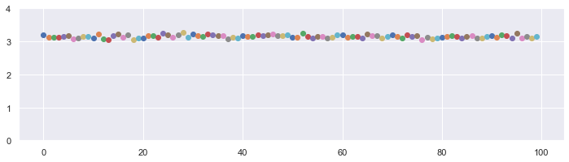

## Introduction to Montecarlo Method

In this notebook, we will calculate value of ```pi``` by implementation of Monte Carlo Simulation

------------------------


```python
import random
import matplotlib.pyplot as plt
import numpy as np
import pylab
import seaborn as sns
sns.set()
%matplotlib inline
```

#### Lets calculate the value of PI directly:
In this method we randomly generate the points and calculate the ratio for value of PI.


```python
n_trials = 10000
n_hits = 0
plt.figure(figsize = [10,10])
for iter in range(n_trials):
    x = random.uniform(-1.0, 1.0)
    y = random.uniform(-1.0, 1.0)
    if x**2 + y**2 < 1.0: 
        plt.scatter(x,y,color = "blue",marker='.')
        n_hits += 1
    else:
         plt.scatter(x,y,color = "red",marker ='.')
print(4.0 * n_hits / float(n_trials))
```

    3.174


* Lets construct the function to run above code multiple time


```python
def direct_pi(N):
    n_hits = 0
    for i in range(N):
        x = random.uniform(-1.0, 1.0)
        y = random.uniform(-1.0, 1.0)
        if x ** 2 + y ** 2 < 1.0:
            n_hits += 1
    computed_pi = 4.0*n_hits / float(n_trials)        
    return computed_pi
```


```python
n_runs = 100
n_trials = 1000
plt.figure(figsize = [12,3])
for run in range(n_runs):
    pi = direct_pi(n_trials) 
    plt.scatter(run,pi)
plt.ylim([0,4.0])
plt.xlabel("No of Run")
plt.ylabel("Value of Pi")
plt.show()
```





#### Marcob chain Calculation of PI:
In this method we perform a random walk and accept or reject the move.


```python
x, y = 1.0, 1.0
delta = 0.1
n_trials = 5000
n_hits = 0

plt.figure(figsize = [10,10])
for i in range(n_trials):
    del_x = random.uniform(-delta, delta)
    del_y = random.uniform(-delta, delta)
    
    '''to make sure they are inside square'''
    if (abs(x + del_x) < 1.0 and abs(y + del_y) < 1.0):
        x = x + del_x
        y = y + del_y
        
    '''to make sure they are inside circle'''
    if x**2 + y**2 < 1.0:
        n_hits += 1  
        plt.scatter(x,y,color = "blue", marker='.')
    else:
        plt.scatter(x,y,color = "red", marker='.')
        
print(4.0 * n_hits / float(n_trials))
```

    3.2256


* Lets construct the function to run above code multiple time.


```python
def markov_pi(N, delta): 
    x, y = 1.0, 1.0
    n_hits = 0
    for i in range(N):
        del_x, del_y = random.uniform(-delta, delta),\
                       random.uniform(-delta, delta)
        
        if abs(x + del_x) < 1.0 and abs(y + del_y) < 1.0:
                x, y = x + del_x, y + del_y
        if x**2 + y**2 < 1.0: n_hits += 1
        computed_pi = 4.0 * n_hits / float(n_trials)    
    return computed_pi
```


```python
n_runs = 100
n_trials = 10000
delta = 0.1
plt.figure(figsize = [12,3])
for run in range(n_runs):
    pi =  markov_pi(n_trials, delta)
    plt.scatter(run,pi)
plt.ylim([0,4.0])
plt.xlabel("No of Run")
plt.ylabel("Value of Pi")
plt.show()
```


