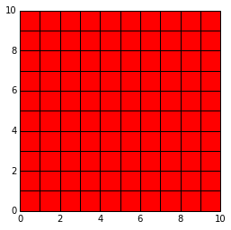
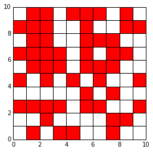
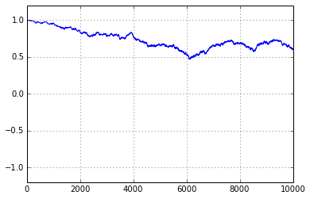
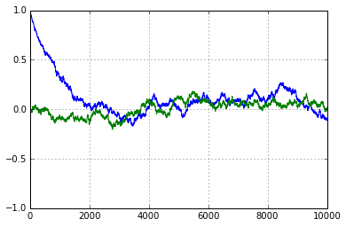
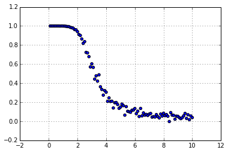

# Ising Model - 2D using Importance Sampling

First of all we import the required libraries:

Date - Oct -9-2015


```
import matplotlib.pyplot as plt
import math as math
import random as random
import pylab as pylab
import numpy as np
```

### Global parameters

Then we set some global variables:


```
Kb = 1.0
JJ = 1.0
```

### Cold Start and Hot Start

Before begining simulation, if we select all spin up or all spin down then it is called cold configuration.


```
def cold_start(L):
    U = [[1.0 for k in range(L)]for l in range(L)]
    return U
    
```

We can make a plot of this cold configuration by the help of Uplotter :


```
CU = cold_start(10)
Uplotter(CU)
```





 if we select spin randomly up or down then it is called cold configuration


```
def hot_start(L): 
      U = [[0.0 for i in range(L)]for j in range(L)]
      for i in range(L):
          for j in range(L):
              t = random.sample([-1,1],1)
              U[i][j] = t[0]  
      return U 
```

Similarly we can plot thishot configuration as well.


```
HU = hot_start(10)
Uplotter(HU)
```





### Hamiltonian

Hamiltonian of  L by L lattice is given by

$H = - J \sum_{i\neq j} S_{i}S_{j}$


```
def Hamiltonian(U):
      H = 0.0
      L = len(U)
      for i in range(L):
          for j in range(L):
                
              ni = 0;nj =0;
              if i == 0: ni = L
              if j == 0: nj = L
           
              H = H -  0.5*JJ*U[i][j]*(U[i][(j-1)+nj] \
                        + U[(i+1)%L][j] \
                        + U[i][(j+1)%L] \
                        + U[(i-1)+ni][j])   
      return H
```

One can check what are hamiltonian for hot and cold start:


```
Hamiltonian(CU)
```


    -200.0


```
Hamiltonian(HU)
```


    12.0


### Mangnetization

One can calculate magnetization by simply taking average over all spins:


```
def magnetization(U):
     m = 0.0
     L = len(U)
     for i in range(L):
          for j in range(L):
              m = m + U[i][j]
     m = m/float(L*L)           
     return m
        
```


```
magnetization(HU)
```


    0.02


```
magnetization(CU)
```


    1.0


### Spin Flipper


```
def ld(k,L):
    if k == 0:
        return L
    else: return 0
```


```
def spin_flipper(U,printkey):
        L = len(U)
        
        i = random.randint(0, L-1) 
        j = random.randint(0, L-1)
       
        if printkey ==1:print "flipped at", i,j
            
        U[i][j] = -U[i][j]
       
           
        dH =  -2.0*JJ*U[i][j]*(U[i][(j-1)+ld(j,L)] \
                            + U[(i+1)%L][j] \
                            + U[i][(j+1)%L] \
                            + U[(i-1)+ld(i,L)][j])      
        
        return U,dH,i,j 
```

### Thermalization


```
def Thermalization(U,T,nrun,printkey) :
        M = [0.0 for k in range(nrun)]
        irun = 0       
       
       
        while irun < nrun:
                    V = U
                    w = magnetization(U)
                    
                    U,dH,p,q = spin_flipper(U,printkey)
                   
                   
                    if dH < 0:
                        
                        if printkey ==1: print irun, "E decreased! You are accepted !",dH
                            
                        M[irun] = magnetization(U)
                       
                    else:
                        
                       if printkey ==1:print irun, "E increased!",dH
                            
                       frac = math.exp(-dH/(Kb*T))
                       b = random.uniform(0.0,1.0)
                            
                       if printkey ==1:print "frac =",frac,"b=",b,"dH = ",dH
                                
                       if  b < frac:
                                    
                            if printkey ==1:print irun, " You Lucky!"
                                
                            M[irun] = magnetization(U)
                             
                       else:
                            if printkey ==1: print irun, "Loser!"
                            if printkey ==1: print "spin restablished at",p,q
                            U[p][q] = -U[p][q]
                            M[irun] = w 
                           
                            
                    for i in range(L):
                        for j in range(L):
                            if U[i][j] != V[i][i]:
                                 if printkey ==1: print"Warning!spin is changed!", i,j 
                            
                    
                    
                    
                    if printkey ==2 : print irun, M[irun]   
                    irun = irun +1
        return M,U
```

Lets print out some measurements of m


```
nrun = 100
T = 1.0
L = 10
U = cold_start(L)  
M,U = Thermalization(U,T,nrun, 1)
```

    flipped at 2 6
    0 E increased! 8.0
    frac = 0.000335462627903 b= 0.200945442416 dH =  8.0
    0 Loser!
    spin restablished at 2 6
    flipped at 5 3
    1 E increased! 8.0
    frac = 0.000335462627903 b= 0.208228177318 dH =  8.0
    1 Loser!
    spin restablished at 5 3
    flipped at 3 9
    2 E increased! 8.0
    frac = 0.000335462627903 b= 0.518140057869 dH =  8.0
    2 Loser!
    spin restablished at 3 9
    flipped at 7 2
    3 E increased! 8.0
    frac = 0.000335462627903 b= 0.453525585218 dH =  8.0
    3 Loser!
    spin restablished at 7 2
    flipped at 4 2
    4 E increased! 8.0
    frac = 0.000335462627903 b= 0.301315970059 dH =  8.0
    4 Loser!
    spin restablished at 4 2
    flipped at 1 1
    5 E increased! 8.0
    frac = 0.000335462627903 b= 0.559871016385 dH =  8.0
    5 Loser!
    spin restablished at 1 1
    flipped at 3 7
    6 E increased! 8.0
    frac = 0.000335462627903 b= 0.364710311714 dH =  8.0
    6 Loser!
    spin restablished at 3 7
    flipped at 4 9
    7 E increased! 8.0
    frac = 0.000335462627903 b= 0.589989052706 dH =  8.0
    7 Loser!
    spin restablished at 4 9
    flipped at 5 7
    8 E increased! 8.0
    frac = 0.000335462627903 b= 0.00373832879324 dH =  8.0
    8 Loser!
    spin restablished at 5 7
    flipped at 7 8
    9 E increased! 8.0
    frac = 0.000335462627903 b= 0.667080358921 dH =  8.0
    9 Loser!
    spin restablished at 7 8
    flipped at 2 8
    10 E increased! 8.0
    frac = 0.000335462627903 b= 0.958643303676 dH =  8.0
    10 Loser!
    spin restablished at 2 8
    flipped at 2 0
    11 E increased! 8.0
    frac = 0.000335462627903 b= 0.117960949982 dH =  8.0
    11 Loser!
    spin restablished at 2 0
    flipped at 1 7
    12 E increased! 8.0
    frac = 0.000335462627903 b= 0.128279159058 dH =  8.0
    12 Loser!
    spin restablished at 1 7
    flipped at 1 6
    13 E increased! 8.0
    frac = 0.000335462627903 b= 0.41237756183 dH =  8.0
    13 Loser!
    spin restablished at 1 6
    flipped at 3 4
    14 E increased! 8.0
    frac = 0.000335462627903 b= 0.208921911192 dH =  8.0
    14 Loser!
    spin restablished at 3 4
    flipped at 5 4
    15 E increased! 8.0
    frac = 0.000335462627903 b= 0.121113318063 dH =  8.0
    15 Loser!
    spin restablished at 5 4
    flipped at 2 1
    16 E increased! 8.0
    frac = 0.000335462627903 b= 0.91059155363 dH =  8.0
    16 Loser!
    spin restablished at 2 1
    flipped at 2 2
    17 E increased! 8.0
    frac = 0.000335462627903 b= 0.0312121693169 dH =  8.0
    17 Loser!
    spin restablished at 2 2
    flipped at 7 5
    18 E increased! 8.0
    frac = 0.000335462627903 b= 0.44423543869 dH =  8.0
    18 Loser!
    spin restablished at 7 5
    flipped at 9 8
    19 E increased! 8.0
    frac = 0.000335462627903 b= 0.838164630904 dH =  8.0
    19 Loser!
    spin restablished at 9 8
    flipped at 4 4
    20 E increased! 8.0
    frac = 0.000335462627903 b= 0.978984488947 dH =  8.0
    20 Loser!
    spin restablished at 4 4
    flipped at 9 1
    21 E increased! 8.0
    frac = 0.000335462627903 b= 0.660100062089 dH =  8.0
    21 Loser!
    spin restablished at 9 1
    flipped at 0 9
    22 E increased! 8.0
    frac = 0.000335462627903 b= 0.384350846156 dH =  8.0
    22 Loser!
    spin restablished at 0 9
    flipped at 8 3
    23 E increased! 8.0
    frac = 0.000335462627903 b= 0.147521237768 dH =  8.0
    23 Loser!
    spin restablished at 8 3
    flipped at 1 2
    24 E increased! 8.0
    frac = 0.000335462627903 b= 0.245418005023 dH =  8.0
    24 Loser!
    spin restablished at 1 2
    flipped at 7 4
    25 E increased! 8.0
    frac = 0.000335462627903 b= 0.566226070388 dH =  8.0
    25 Loser!
    spin restablished at 7 4
    flipped at 8 6
    26 E increased! 8.0
    frac = 0.000335462627903 b= 0.470824511812 dH =  8.0
    26 Loser!
    spin restablished at 8 6
    flipped at 9 1
    27 E increased! 8.0
    frac = 0.000335462627903 b= 0.468902208133 dH =  8.0
    27 Loser!
    spin restablished at 9 1
    flipped at 3 3
    28 E increased! 8.0
    frac = 0.000335462627903 b= 0.956164659389 dH =  8.0
    28 Loser!
    spin restablished at 3 3
    flipped at 7 5
    29 E increased! 8.0
    frac = 0.000335462627903 b= 0.427388520837 dH =  8.0
    29 Loser!
    spin restablished at 7 5
    flipped at 9 2
    30 E increased! 8.0
    frac = 0.000335462627903 b= 0.043987391181 dH =  8.0
    30 Loser!
    spin restablished at 9 2
    flipped at 7 8
    31 E increased! 8.0
    frac = 0.000335462627903 b= 0.666327053159 dH =  8.0
    31 Loser!
    spin restablished at 7 8
    flipped at 7 0
    32 E increased! 8.0
    frac = 0.000335462627903 b= 0.515433733306 dH =  8.0
    32 Loser!
    spin restablished at 7 0
    flipped at 2 8
    33 E increased! 8.0
    frac = 0.000335462627903 b= 0.167613150653 dH =  8.0
    33 Loser!
    spin restablished at 2 8
    flipped at 0 3
    34 E increased! 8.0
    frac = 0.000335462627903 b= 0.345178826725 dH =  8.0
    34 Loser!
    spin restablished at 0 3
    flipped at 0 1
    35 E increased! 8.0
    frac = 0.000335462627903 b= 0.513958539065 dH =  8.0
    35 Loser!
    spin restablished at 0 1
    flipped at 6 8
    36 E increased! 8.0
    frac = 0.000335462627903 b= 0.4871901386 dH =  8.0
    36 Loser!
    spin restablished at 6 8
    flipped at 7 2
    37 E increased! 8.0
    frac = 0.000335462627903 b= 0.59898662047 dH =  8.0
    37 Loser!
    spin restablished at 7 2
    flipped at 4 9
    38 E increased! 8.0
    frac = 0.000335462627903 b= 0.0847937443966 dH =  8.0
    38 Loser!
    spin restablished at 4 9
    flipped at 5 6
    39 E increased! 8.0
    frac = 0.000335462627903 b= 0.098801882584 dH =  8.0
    39 Loser!
    spin restablished at 5 6
    flipped at 2 4
    40 E increased! 8.0
    frac = 0.000335462627903 b= 0.653577770213 dH =  8.0
    40 Loser!
    spin restablished at 2 4
    flipped at 7 3
    41 E increased! 8.0
    frac = 0.000335462627903 b= 0.302675497483 dH =  8.0
    41 Loser!
    spin restablished at 7 3
    flipped at 2 6
    42 E increased! 8.0
    frac = 0.000335462627903 b= 0.46557731556 dH =  8.0
    42 Loser!
    spin restablished at 2 6
    flipped at 1 0
    43 E increased! 8.0
    frac = 0.000335462627903 b= 0.0854198113429 dH =  8.0
    43 Loser!
    spin restablished at 1 0
    flipped at 1 9
    44 E increased! 8.0
    frac = 0.000335462627903 b= 0.666489537978 dH =  8.0
    44 Loser!
    spin restablished at 1 9
    flipped at 5 0
    45 E increased! 8.0
    frac = 0.000335462627903 b= 0.214381681158 dH =  8.0
    45 Loser!
    spin restablished at 5 0
    flipped at 0 1
    46 E increased! 8.0
    frac = 0.000335462627903 b= 0.947652883231 dH =  8.0
    46 Loser!
    spin restablished at 0 1
    flipped at 2 7
    47 E increased! 8.0
    frac = 0.000335462627903 b= 0.224155338588 dH =  8.0
    47 Loser!
    spin restablished at 2 7
    flipped at 1 1
    48 E increased! 8.0
    frac = 0.000335462627903 b= 0.922718106128 dH =  8.0
    48 Loser!
    spin restablished at 1 1
    flipped at 3 0
    49 E increased! 8.0
    frac = 0.000335462627903 b= 0.226445418861 dH =  8.0
    49 Loser!
    spin restablished at 3 0
    flipped at 6 6
    50 E increased! 8.0
    frac = 0.000335462627903 b= 0.859615061628 dH =  8.0
    50 Loser!
    spin restablished at 6 6
    flipped at 4 6
    51 E increased! 8.0
    frac = 0.000335462627903 b= 0.104605351213 dH =  8.0
    51 Loser!
    spin restablished at 4 6
    flipped at 9 8
    52 E increased! 8.0
    frac = 0.000335462627903 b= 0.762546438422 dH =  8.0
    52 Loser!
    spin restablished at 9 8
    flipped at 5 6
    53 E increased! 8.0
    frac = 0.000335462627903 b= 0.37637421483 dH =  8.0
    53 Loser!
    spin restablished at 5 6
    flipped at 0 4
    54 E increased! 8.0
    frac = 0.000335462627903 b= 0.22018392926 dH =  8.0
    54 Loser!
    spin restablished at 0 4
    flipped at 6 3
    55 E increased! 8.0
    frac = 0.000335462627903 b= 0.559080327422 dH =  8.0
    55 Loser!
    spin restablished at 6 3
    flipped at 0 4
    56 E increased! 8.0
    frac = 0.000335462627903 b= 0.067818661091 dH =  8.0
    56 Loser!
    spin restablished at 0 4
    flipped at 0 1
    57 E increased! 8.0
    frac = 0.000335462627903 b= 0.592962993336 dH =  8.0
    57 Loser!
    spin restablished at 0 1
    flipped at 7 5
    58 E increased! 8.0
    frac = 0.000335462627903 b= 0.359231837157 dH =  8.0
    58 Loser!
    spin restablished at 7 5
    flipped at 9 7
    59 E increased! 8.0
    frac = 0.000335462627903 b= 0.365371314382 dH =  8.0
    59 Loser!
    spin restablished at 9 7
    flipped at 1 4
    60 E increased! 8.0
    frac = 0.000335462627903 b= 0.0238130043524 dH =  8.0
    60 Loser!
    spin restablished at 1 4
    flipped at 1 2
    61 E increased! 8.0
    frac = 0.000335462627903 b= 0.171939714452 dH =  8.0
    61 Loser!
    spin restablished at 1 2
    flipped at 1 4
    62 E increased! 8.0
    frac = 0.000335462627903 b= 0.798151394609 dH =  8.0
    62 Loser!
    spin restablished at 1 4
    flipped at 5 9
    63 E increased! 8.0
    frac = 0.000335462627903 b= 0.521864864986 dH =  8.0
    63 Loser!
    spin restablished at 5 9
    flipped at 4 8
    64 E increased! 8.0
    frac = 0.000335462627903 b= 0.039200037808 dH =  8.0
    64 Loser!
    spin restablished at 4 8
    flipped at 9 3
    65 E increased! 8.0
    frac = 0.000335462627903 b= 0.907378398139 dH =  8.0
    65 Loser!
    spin restablished at 9 3
    flipped at 3 9
    66 E increased! 8.0
    frac = 0.000335462627903 b= 0.786255454713 dH =  8.0
    66 Loser!
    spin restablished at 3 9
    flipped at 1 8
    67 E increased! 8.0
    frac = 0.000335462627903 b= 0.151408860995 dH =  8.0
    67 Loser!
    spin restablished at 1 8
    flipped at 2 7
    68 E increased! 8.0
    frac = 0.000335462627903 b= 0.677180391392 dH =  8.0
    68 Loser!
    spin restablished at 2 7
    flipped at 7 5
    69 E increased! 8.0
    frac = 0.000335462627903 b= 0.626863122695 dH =  8.0
    69 Loser!
    spin restablished at 7 5
    flipped at 2 1
    70 E increased! 8.0
    frac = 0.000335462627903 b= 0.66123249829 dH =  8.0
    70 Loser!
    spin restablished at 2 1
    flipped at 0 4
    71 E increased! 8.0
    frac = 0.000335462627903 b= 0.293850188133 dH =  8.0
    71 Loser!
    spin restablished at 0 4
    flipped at 3 4
    72 E increased! 8.0
    frac = 0.000335462627903 b= 0.594377916307 dH =  8.0
    72 Loser!
    spin restablished at 3 4
    flipped at 0 2
    73 E increased! 8.0
    frac = 0.000335462627903 b= 0.2981661573 dH =  8.0
    73 Loser!
    spin restablished at 0 2
    flipped at 0 6
    74 E increased! 8.0
    frac = 0.000335462627903 b= 0.632308851963 dH =  8.0
    74 Loser!
    spin restablished at 0 6
    flipped at 3 4
    75 E increased! 8.0
    frac = 0.000335462627903 b= 0.0121514733002 dH =  8.0
    75 Loser!
    spin restablished at 3 4
    flipped at 4 5
    76 E increased! 8.0
    frac = 0.000335462627903 b= 0.264421186353 dH =  8.0
    76 Loser!
    spin restablished at 4 5
    flipped at 2 4
    77 E increased! 8.0
    frac = 0.000335462627903 b= 0.824902228556 dH =  8.0
    77 Loser!
    spin restablished at 2 4
    flipped at 0 7
    78 E increased! 8.0
    frac = 0.000335462627903 b= 0.0214405875202 dH =  8.0
    78 Loser!
    spin restablished at 0 7
    flipped at 1 5
    79 E increased! 8.0
    frac = 0.000335462627903 b= 0.210900739425 dH =  8.0
    79 Loser!
    spin restablished at 1 5
    flipped at 4 5
    80 E increased! 8.0
    frac = 0.000335462627903 b= 0.574664768366 dH =  8.0
    80 Loser!
    spin restablished at 4 5
    flipped at 2 7
    81 E increased! 8.0
    frac = 0.000335462627903 b= 0.847649373404 dH =  8.0
    81 Loser!
    spin restablished at 2 7
    flipped at 7 3
    82 E increased! 8.0
    frac = 0.000335462627903 b= 0.832491150391 dH =  8.0
    82 Loser!
    spin restablished at 7 3
    flipped at 1 2
    83 E increased! 8.0
    frac = 0.000335462627903 b= 0.855154490886 dH =  8.0
    83 Loser!
    spin restablished at 1 2
    flipped at 8 7
    84 E increased! 8.0
    frac = 0.000335462627903 b= 0.655322271761 dH =  8.0
    84 Loser!
    spin restablished at 8 7
    flipped at 0 1
    85 E increased! 8.0
    frac = 0.000335462627903 b= 0.406890106087 dH =  8.0
    85 Loser!
    spin restablished at 0 1
    flipped at 1 2
    86 E increased! 8.0
    frac = 0.000335462627903 b= 0.000673501357872 dH =  8.0
    86 Loser!
    spin restablished at 1 2
    flipped at 3 5
    87 E increased! 8.0
    frac = 0.000335462627903 b= 0.507304936668 dH =  8.0
    87 Loser!
    spin restablished at 3 5
    flipped at 2 0
    88 E increased! 8.0
    frac = 0.000335462627903 b= 0.245869405573 dH =  8.0
    88 Loser!
    spin restablished at 2 0
    flipped at 0 3
    89 E increased! 8.0
    frac = 0.000335462627903 b= 0.718536865241 dH =  8.0
    89 Loser!
    spin restablished at 0 3
    flipped at 1 5
    90 E increased! 8.0
    frac = 0.000335462627903 b= 0.736465815937 dH =  8.0
    90 Loser!
    spin restablished at 1 5
    flipped at 4 7
    91 E increased! 8.0
    frac = 0.000335462627903 b= 0.265875688904 dH =  8.0
    91 Loser!
    spin restablished at 4 7
    flipped at 1 1
    92 E increased! 8.0
    frac = 0.000335462627903 b= 0.954550813922 dH =  8.0
    92 Loser!
    spin restablished at 1 1
    flipped at 5 3
    93 E increased! 8.0
    frac = 0.000335462627903 b= 0.0460167879754 dH =  8.0
    93 Loser!
    spin restablished at 5 3
    flipped at 6 9
    94 E increased! 8.0
    frac = 0.000335462627903 b= 0.198101449804 dH =  8.0
    94 Loser!
    spin restablished at 6 9
    flipped at 5 1
    95 E increased! 8.0
    frac = 0.000335462627903 b= 0.725967185102 dH =  8.0
    95 Loser!
    spin restablished at 5 1
    flipped at 4 5
    96 E increased! 8.0
    frac = 0.000335462627903 b= 0.985048609735 dH =  8.0
    96 Loser!
    spin restablished at 4 5
    flipped at 4 9
    97 E increased! 8.0
    frac = 0.000335462627903 b= 0.530198025988 dH =  8.0
    97 Loser!
    spin restablished at 4 9
    flipped at 0 7
    98 E increased! 8.0
    frac = 0.000335462627903 b= 0.291920780419 dH =  8.0
    98 Loser!
    spin restablished at 0 7
    flipped at 9 5
    99 E increased! 8.0
    frac = 0.000335462627903 b= 0.885533031239 dH =  8.0
    99 Loser!
    spin restablished at 9 5


### Mplotter


```
def thrmal_plotter(M,nrun) :
        X = np.arange(0,len(M),1)
        plt.figure(1)
        plt.grid()
        plt.plot(X,M,"-")
        plt.axis([0,nrun,-1.2,1.2])
        plt.show()     
            
        return         
```


```
L = 20
nrun = 10000
T = 2.4
U = cold_start(L) 
M,U = Thermalization(U,T,nrun, 0)
thrmal_plotter(M,nrun)
#Uplotter(U)
```





We can plot both run with hot and cold start together:


```
L =20
nrun = 10000
T = 5.0
U1 = cold_start(L) 
U2 = hot_start(L)
M1,U1 = Thermalization(U1,T,nrun,0)
M2,U2 = Thermalization(U2,T,nrun,0)
X = np.arange(0,len(M1),1)

plt.figure(1)
plt.grid()
plt.plot(X,M1,"-")
plt.plot(X,M2,"-")
plt.axis([0,nrun,-1,1])
plt.show()

```





### Phase Transition


```
L = 32
nrun = 10000
Tn = 100
avm = []
KT = []
for t in range(1,Tn+1):
        T = 0.1*t
        KT.append(T)
        U = cold_start(L)
        M,U = Thermalization(U,T,nrun,0)
        nM = M[1000:nrun-1]
        avm.append(np.mean(nM))
       
 
plt.figure()
plt.scatter(KT,avm)
#plt.axis([0,1,-1,1])
plt.grid()
plt.show() 


```





### Uplotter


```
def Uplotter(List):
    
        '''List = List to be plotted
           dim = dimension of matrix
           tics = x and y tics applied'''
        dim = len(List[0])
        tics = 1
        tt = 1.0
        s_map = [(float(p),float(q)) for p in range(dim) for q in range(dim)]
        site = 0
        for p in range(dim):
             for q in range(dim):
               if List[p][q] == -1 :
                  rtgl = pylab.Rectangle(s_map[site], tt,tt, fc='white')
                  pylab.gca().add_patch(rtgl)
               if List[p][q] == 1 :
                  rtgl = pylab.Rectangle(s_map[site], tt,tt, fc='red')
                  pylab.gca().add_patch(rtgl)
               site = site+1
    
    
        Dx = float(dim) 
        Dy = float(dim)
        pylab.axis('scaled')
        pylab.axis([0.0,Dx,0.0,Dy])
        #pylab.xticks([(tics)*k for k in range(int(dim/tics))])
        #pylab.yticks([(tics)*k for k in range(int(dim/tics))])
        pylab.show()
        return   
         
```
