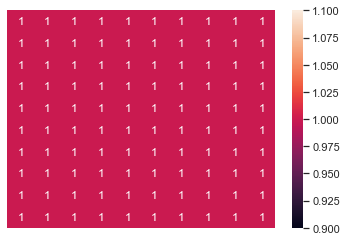
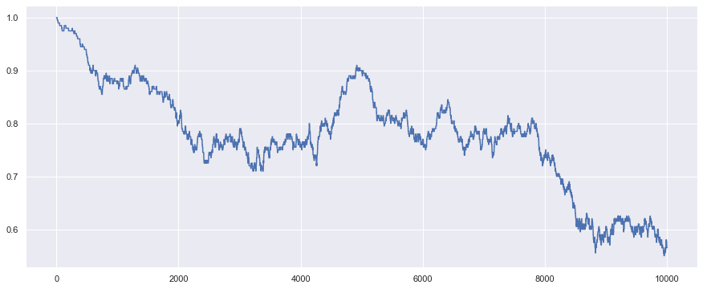

# Ising Model - 2D : Monte Carlo Simulation

First of all we import the required libraries:


```python
import matplotlib.pyplot as plt
import math as math
import random as random
import pylab as pylab
import numpy as np
import seaborn as sns
sns.set()
```

### Global parameters

Then we set some global variables:


```python
Kb = 1.0
JJ = 1.0
```

### Cold Start and Hot Start

Before begining simulation, if we select all spin up or all spin down then it is called cold configuration.


```python
def cold_start(L):
    U = [[1.0 for k in range(L)]for l in range(L)]
    return U   
```

We can make a plot of this cold configuration by the help of Uplotter :


```python
CU = cold_start(10)
sns.heatmap(CU,annot =True)
plt.axis(False)
```


    (0.0, 10.0, 10.0, 0.0)





 if we select spin randomly up or down then it is called cold configuration


```python
def hot_start(L): 
    U = [[0.0 for i in range(L)]for j in range(L)]
    for i in range(L):
          for j in range(L):
            t = random.sample([-1,1],1)
            U[i][j] = t[0]  
    return U 
```

Similarly we can plot thishot configuration as well.


```python
HU = hot_start(10)
sns.heatmap(HU,annot =True)
plt.axis(False)
```


    (0.0, 10.0, 10.0, 0.0)


### Hamiltonian

Hamiltonian of  L by L lattice is given by

\\( H = - J \sum_{i\neq j} S_{i}S_{j} \\)


```python
def Hamiltonian(U):
    H = 0.0
    L = len(U)
    for i in range(L):
        for j in range(L):
                
            ni = 0;nj =0;
            if i == 0: ni = L
            if j == 0: nj = L
           
            H = H -  0.5*JJ*U[i][j]*(U[i][(j-1)+nj] \
                        + U[(i+1)%L][j] \
                        + U[i][(j+1)%L] \
                        + U[(i-1)+ni][j])   
    return H
```

One can check what are hamiltonian for hot and cold start:


```python
Hamiltonian(CU)
```


    -200.0


```python
Hamiltonian(HU)
```


    12.0


### Mangnetization

One can calculate magnetization by simply taking average over all spins:


```python
def magnetization(U):
    return np.array(U).sum()/float(len(U*len(U)))          
```


```python
magnetization(HU)
```


    0.04


```python
magnetization(CU)
```


    1.0


### Spin Flipper


```python
def ld(k,L):
    if k == 0:
        return L
    else: return 0
```


```python
def spin_flipper(U,printkey):
        L = len(U)
        
        i = random.randint(0, L-1) 
        j = random.randint(0, L-1)
       
        if printkey ==1:print("flipped at", i,j)
            
        U[i][j] = -U[i][j]
       
           
        dH =  -2.0*JJ*U[i][j]*(U[i][(j-1)+ld(j,L)] \
                            + U[(i+1)%L][j] \
                            + U[i][(j+1)%L] \
                            + U[(i-1)+ld(i,L)][j])      
        
        return U,dH,i,j 
```

### Thermalization


```python
def Thermalization(U,T,nrun,printkey) :
        M = [0.0 for k in range(nrun)]
        irun = 0       
       
       
        while irun < nrun:
                    V = U
                    w = magnetization(U)
                    
                    U,dH,p,q = spin_flipper(U,printkey)
                   
                   
                    if dH < 0:
                        
                        if printkey ==1: print(irun, "E decreased! You are accepted !",dH)
                            
                        M[irun] = magnetization(U)
                       
                    else:
                        
                        if printkey ==1:print(irun, "E increased!",dH)
                            
                        frac = math.exp(-dH/(Kb*T))
                        b = random.uniform(0.0,1.0)
                            
                        if printkey ==1:print("frac =",frac,"b=",b,"dH = ",dH)
                                
                        if  b < frac:
                                    
                            if printkey ==1:print(irun, " You Lucky!")
                                
                            M[irun] = magnetization(U)
                             
                        else:
                            if printkey ==1: print(irun, "Loser!")
                            if printkey ==1: print("spin restablished at",p,q)
                            U[p][q] = -U[p][q]
                            M[irun] = w 
                           
                            
                    for i in range(L):
                        for j in range(L):
                            if U[i][j] != V[i][i]:
                                 if printkey ==1: print("Warning!spin is changed!", i,j) 
                            
                    
                    
                    
                    if printkey ==2 : print(irun, M[irun])   
                    irun = irun +1
        return M,U
```

Lets print out some measurements of m


```python
nrun = 20
T = 1.0
L = 10
U = cold_start(L)  
M,U = Thermalization(U,T,nrun, 1)
```

    flipped at 6 1
    0 E increased! 8.0
    frac = 0.00033546262790251185 b= 0.5671077259055917 dH =  8.0
    0 Loser!
    spin restablished at 6 1
    flipped at 5 2
    1 E increased! 8.0
    frac = 0.00033546262790251185 b= 0.3231620080611951 dH =  8.0
    1 Loser!
    spin restablished at 5 2
    flipped at 7 1
    2 E increased! 8.0
    frac = 0.00033546262790251185 b= 0.11202501799113995 dH =  8.0
    2 Loser!
    spin restablished at 7 1
    flipped at 5 1
    3 E increased! 8.0
    frac = 0.00033546262790251185 b= 0.9403656345766181 dH =  8.0
    3 Loser!
    spin restablished at 5 1
    flipped at 0 0
    4 E increased! 8.0
    frac = 0.00033546262790251185 b= 0.14218890326015643 dH =  8.0
    4 Loser!
    spin restablished at 0 0
    flipped at 5 0
    5 E increased! 8.0
    frac = 0.00033546262790251185 b= 0.0963025212725882 dH =  8.0
    5 Loser!
    spin restablished at 5 0
    flipped at 0 8
    6 E increased! 8.0
    frac = 0.00033546262790251185 b= 0.565791348883872 dH =  8.0
    6 Loser!
    spin restablished at 0 8
    flipped at 3 7
    7 E increased! 8.0
    frac = 0.00033546262790251185 b= 0.3387910454379671 dH =  8.0
    7 Loser!
    spin restablished at 3 7
    flipped at 9 1
    8 E increased! 8.0
    frac = 0.00033546262790251185 b= 0.1936472524177364 dH =  8.0
    8 Loser!
    spin restablished at 9 1
    flipped at 7 0
    9 E increased! 8.0
    frac = 0.00033546262790251185 b= 0.24948905296269597 dH =  8.0
    9 Loser!
    spin restablished at 7 0
    flipped at 6 7
    10 E increased! 8.0
    frac = 0.00033546262790251185 b= 0.518899292783646 dH =  8.0
    10 Loser!
    spin restablished at 6 7
    flipped at 8 1
    11 E increased! 8.0
    frac = 0.00033546262790251185 b= 0.13159925938392314 dH =  8.0
    11 Loser!
    spin restablished at 8 1
    flipped at 5 4
    12 E increased! 8.0
    frac = 0.00033546262790251185 b= 0.11321720447730321 dH =  8.0
    12 Loser!
    spin restablished at 5 4
    flipped at 2 5
    13 E increased! 8.0
    frac = 0.00033546262790251185 b= 0.9225608625932972 dH =  8.0
    13 Loser!
    spin restablished at 2 5
    flipped at 4 5
    14 E increased! 8.0
    frac = 0.00033546262790251185 b= 0.31039416582757795 dH =  8.0
    14 Loser!
    spin restablished at 4 5
    flipped at 9 2
    15 E increased! 8.0
    frac = 0.00033546262790251185 b= 0.8360880711041137 dH =  8.0
    15 Loser!
    spin restablished at 9 2
    flipped at 9 8
    16 E increased! 8.0
    frac = 0.00033546262790251185 b= 0.26428473982836087 dH =  8.0
    16 Loser!
    spin restablished at 9 8
    flipped at 7 2
    17 E increased! 8.0
    frac = 0.00033546262790251185 b= 0.3292714399864062 dH =  8.0
    17 Loser!
    spin restablished at 7 2
    flipped at 1 4
    18 E increased! 8.0
    frac = 0.00033546262790251185 b= 0.1478523271555081 dH =  8.0
    18 Loser!
    spin restablished at 1 4
    flipped at 1 3
    19 E increased! 8.0
    frac = 0.00033546262790251185 b= 0.2466252577141801 dH =  8.0
    19 Loser!
    spin restablished at 1 3


```python
L = 20
nrun = 10000
T = 2.4
U = cold_start(L) 
M,U = Thermalization(U,T,nrun, 0)
X = np.arange(0,len(M),1)
plt.figure(figsize = [15,6])
plt.plot(X,M,"-")
plt.show() 
```





We can plot both run with hot and cold start together:


```python
L =20
nrun = 10000
T = 5.0
U1 = cold_start(L) 
U2 = hot_start(L)
M1,U1 = Thermalization(U1,T,nrun,0)
M2,U2 = Thermalization(U2,T,nrun,0)
X = np.arange(0,len(M1),1)

plt.figure(figsize = [15,6])
plt.plot(X,M1,"-")
plt.plot(X,M2,"-")
plt.show()

```


### Phase Transition


```python
L = 32
nrun = 10000
Tn = 100
avm = []
KT = []

for t in range(1,Tn+1):
        T = 0.1*t
        KT.append(T)
        U = cold_start(L)
        M,U = Thermalization(U,T,nrun,0)
        nM = M[1000:nrun-1]
        avm.append(np.mean(nM))
       
 

plt.figure(figsize = [10,8])
plt.scatter(KT,avm)
plt.xlabel("Temperature")
plt.ylabel("Average magnetization")
plt.show() 
```


