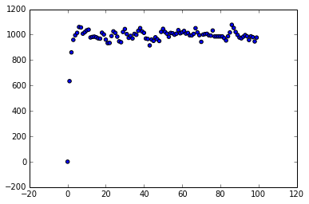

# Harmonic Oscillator using HMC

### Import the Library


```python
'''import section'''
import numpy as np
import matplotlib.pyplot as plt
import math as  math
import random as random
```

We want to apply HMC to collection of 100 independent Harmonic Oscillator to get equilibrium configuration.

### Hamiltonian

Hamiltonian of Harmonic Oscillator in 1D is:
    $H = \frac{1}{2} p^{2} + \frac{1}{2}q^{2}$ with $ m = 1,k = 1$

This function calculates the  total Hamiltonian of the configuration


```python
def hamiltonian(x,p,np):
    '''x,p: x and p are list of position and momentum'''
    '''np : number of particles in the system '''
    H = 0.0
    for k in range(np):
            H = H + ((x[k]*x[k])/2.0 + (p[k]*p[k])/2.0 )
    return H      
```

### Generating Random Momentum

In order to generate random momentum we use "random.gauss"


```python
def drawp(np):
    '''this function returns a list of random numbers'''
    t = [0.0 for k in range(np)]
    for k in range(np):
        r = random.gauss(0.0,1.0)
        t[k] = r
    return(t)       
```

One can check whether the generated numbers are normally distributed or not by doing:


```python

N = 100000 
p = [0.0 for k in range(N)]
p = drawp(N)
num_bins = 20
plt.figure(1)
plt.hist(p,num_bins, normed= 1.0, facecolor='green', alpha = 0.5)
plt.show()
```


### Leap Frog 

We will use leap frog approximation to evolve the system according to time.


```python
def leap_frog(N,dt,ix,ip,np):
    
        ''' N : number of steps to evolve
            dt:  fraction of time ie T  = dt*N
            ix,ip : initial position and momentum
            np : number of the particles in the system
        '''
        ''' Returns
          x,p : final position and momentum'''   
    
    
        x = ix
        p = ip
        k = 0
        while k < N:
            if k == 0:
                    for i in range(np):
                        p[i] = p[i] - ((dt/2.0)*x[i])
            elif k > 0 :
                    if k < N - 1:
                        for i in range(np):   
                            x[i] = x[i] + (dt*p[i])
                            p[i] =   p[i] - (dt*x[i])
                            #S1 = hamiltonian(x,p,np)
                            #print "k =",k,"S1=",S1
                            
            elif k == N - 1:
                          for i in range(np): 
                            p[i] = (p[i] - (dt/2.0)*x[i])
                       
            k = k+1
        return x,p
```

### HMC

Here we run the HMC - simulation


```python
def HMC(np,N,dt,steps,x0):
    
    ''' np : number of particles in the system
        N = number of steps in Leap - Frog
        dt = fraction of time in Leap - Frog
        steps: total steps in HMC '''
    
    
       
    xt = [0.0 for k in range(np)]
    pt = [0.0 for k in range(np)]

    
    p0 = drawp(np)
    H = [0.0 for k in range(steps)]
       
    S0 = hamiltonian(x0,p0,np)
    print "=======>", 0,"S0=", S0


    chain = 1
    total_frac =  0.0
    while chain < steps:
        s_stor = [0.0]
        xt,pt = leap_frog(N,dt,x0,p0,np)
        S1 = hamiltonian(xt,pt,np)
        frac = math.exp(-(S1-S0))
        #print frac
        a = min(1,frac)
        b = random.uniform(0.0,1.0)

        if b < a:
            print "=======>", chain, "S1=",S1,frac,a,b
            H[chain] = S1
            x0 = xt
            p0 = drawp(np)
            S0 = hamiltonian(x0,p0,np)
        else:
            H[chain] = S0
            p0 = drawp(np)
            
        chain = chain+1
            
    return H   
```

### Run HMC

Steps to run

### Seting Constants


```python
np = 1000
N = 1000
dt = 0.001
steps = 100
```

Call HMC


```python
x0 = [1.0 for k in range(np)]
x0 = [random.uniform(0.0,1.0) for k in range(np)]
H = HMC(np,N,dt,steps,x0)  
```

    =======> 0 S0= 634.329642425
    =======> 1 S1= 634.176644431 1.1653226407 1 0.733718825241
    =======> 2 S1= 860.433247645 1.04820040462 1 0.118879577619
    =======> 3 S1= 959.0880056 1.02823941879 1 0.494715009236
    =======> 4 S1= 995.098781516 1.00201905305 1 0.26041376277
    =======> 5 S1= 1014.46067223 0.996173462387 0.996173462387 0.973534507459
    =======> 6 S1= 1060.1975905 1.00650260273 1 0.0433863045125
    =======> 7 S1= 1056.67125783 1.0046068542 1 0.318541041274
    =======> 8 S1= 1007.92542371 0.972470680716 0.972470680716 0.641673826227
    =======> 9 S1= 1019.45210409 0.999868096288 0.999868096288 0.673753652179
    =======> 10 S1= 1033.75761347 1.01455345167 1 0.904224474449
    =======> 11 S1= 1039.33277255 1.00067885822 1 0.922841618884
    =======> 12 S1= 977.786623826 0.969824483296 0.969824483296 0.0534599327409
    =======> 13 S1= 982.135607524 0.981771694716 0.981771694716 0.0888855631239
    =======> 14 S1= 984.434076216 1.00314168125 1 0.900050557869
    =======> 15 S1= 979.489618274 1.00009113341 1 0.65844667362
    =======> 16 S1= 971.111139684 0.999416129807 0.999416129807 0.655811347266
    =======> 17 S1= 968.559937229 0.988931685077 0.988931685077 0.423820846374
    =======> 18 S1= 1015.44100508 1.01079386585 1 0.286496247338
    =======> 19 S1= 1001.41694142 1.00450602184 1 0.083130176045
    =======> 20 S1= 960.860002507 0.990150380448 0.990150380448 0.0519649287677
    =======> 21 S1= 933.474638737 1.00388363176 1 0.46189851642
    =======> 22 S1= 934.623173003 1.00369016883 1 0.495986113076
    =======> 23 S1= 989.4356649 0.996338227827 0.996338227827 0.531254896848
    =======> 24 S1= 1025.92286005 1.00861885908 1 0.313190008068
    =======> 25 S1= 1013.92821481 0.99071689113 0.99071689113 0.758255203087
    =======> 26 S1= 984.231043708 1.00076682019 1 0.843966385214
    =======> 27 S1= 947.27251361 1.01126395915 1 0.583020435715
    =======> 28 S1= 940.456922734 1.02975887887 1 0.595715587061
    =======> 29 S1= 1021.02868528 1.0253436546 1 0.00374011822671
    =======> 30 S1= 1044.50742208 1.01629498318 1 0.879696971454
    =======> 31 S1= 1004.58078536 0.991459152846 0.991459152846 0.707240349329
    =======> 32 S1= 974.925563796 0.998420468809 0.998420468809 0.929684182116
    =======> 33 S1= 990.203727805 1.00391617234 1 0.698723615461
    =======> 34 S1= 970.184852439 0.972615104041 0.972615104041 0.568697026237
    =======> 35 S1= 1006.22736678 1.02654444157 1 0.852950015052
    =======> 36 S1= 998.92636329 0.988291037764 0.988291037764 0.379738519717
    =======> 37 S1= 1030.24158673 0.983339277845 0.983339277845 0.757129957835
    =======> 39 S1= 1025.25902821 2.57411624753e+11 1 0.0463867804879
    =======> 40 S1= 1014.17028424 1.00196224 1 0.43927515854
    =======> 41 S1= 969.658672095 0.99242843551 0.99242843551 0.607817867387
    =======> 42 S1= 965.791453024 0.997937568522 0.997937568522 0.208140784376
    =======> 43 S1= 915.270272438 0.984914926098 0.984914926098 0.0439698970697
    =======> 44 S1= 961.813210918 1.04321328147 1 0.219150007161
    =======> 45 S1= 950.972655041 0.999032011959 0.999032011959 0.469070790857
    =======> 46 S1= 979.203355916 1.00739610649 1 0.987271370304
    =======> 47 S1= 963.762907782 1.0269051626 1 0.228776920354
    =======> 48 S1= 949.920749247 1.00736064522 1 0.443149065727
    =======> 49 S1= 1021.89675351 1.02219667178 1 0.562416696674
    =======> 50 S1= 1045.94052152 1.01372753928 1 0.449516449873
    =======> 51 S1= 1022.03904161 1.00609459087 1 0.216552050456
    =======> 52 S1= 1008.12344917 0.986500719573 0.986500719573 0.484734159393
    =======> 53 S1= 983.162882167 1.00790784095 1 0.636702880429
    =======> 54 S1= 1013.81551942 1.01409814001 1 4.81073520403e-05
    =======> 55 S1= 1010.85292888 1.01025417351 1 0.149774761606
    =======> 56 S1= 999.558517909 1.00130374632 1 0.964433917429
    =======> 57 S1= 1007.70305301 0.991591621018 0.991591621018 0.441621732618
    =======> 58 S1= 1035.64389008 0.99519261928 0.99519261928 0.0886792040929
    =======> 59 S1= 1010.89736177 0.992819333052 0.992819333052 0.919392595293
    =======> 60 S1= 1018.43419346 1.03093518871 1 0.490427219365
    =======> 61 S1= 1029.3748498 1.02052172977 1 0.775699542826
    =======> 62 S1= 1008.38007901 0.981519448603 0.981519448603 0.103399004587
    =======> 63 S1= 1013.60095323 0.995815163828 0.995815163828 0.510309286351
    =======> 64 S1= 994.410649009 0.991837188211 0.991837188211 0.310897384492
    =======> 65 S1= 994.116396391 0.993409094913 0.993409094913 0.768301617641
    =======> 66 S1= 1006.13575458 0.989289998424 0.989289998424 0.0895708870016
    =======> 67 S1= 1050.91856039 0.99704078393 0.99704078393 0.121374733941
    =======> 68 S1= 1017.75278059 0.973890480407 0.973890480407 0.686366119542
    =======> 69 S1= 995.879923494 1.00767777078 1 0.735823324802
    =======> 70 S1= 943.442902305 0.99834110281 0.99834110281 0.55392468377
    =======> 71 S1= 1000.71447811 1.03263450015 1 0.251331122407
    =======> 72 S1= 1004.9542924 0.986986118235 0.986986118235 0.878474840287
    =======> 73 S1= 1006.77014848 1.00896660084 1 0.522078869728
    =======> 74 S1= 994.563680798 1.00299539687 1 0.484478355029
    =======> 75 S1= 992.464156392 1.01160947857 1 0.0726515554188
    =======> 76 S1= 1032.73546321 1.00979569001 1 0.135635688016
    =======> 82 S1= 972.617554632 516459.37774 1 0.218468658673
    =======> 83 S1= 954.034538674 0.988720489167 0.988720489167 0.787692132405
    =======> 84 S1= 987.112031092 1.00765876819 1 0.633473950464
    =======> 85 S1= 1017.30900049 0.987977157391 0.987977157391 0.845728433192
    =======> 86 S1= 1077.42941197 1.0187661378 1 0.220075666386
    =======> 87 S1= 1052.6648128 1.00363767186 1 0.486906416463
    =======> 88 S1= 1021.30595102 1.01204872528 1 0.925931423529
    =======> 89 S1= 997.770911129 1.0139249168 1 0.880471281482
    =======> 90 S1= 977.391794605 1.01080296415 1 0.00720408839598
    =======> 91 S1= 971.101936763 0.994794720856 0.994794720856 0.653042189832
    =======> 92 S1= 984.018511787 0.996881531283 0.996881531283 0.763730120442
    =======> 93 S1= 996.771079992 1.02931942658 1 0.982855323235
    =======> 94 S1= 986.597018438 0.994872537714 0.994872537714 0.81748404728
    =======> 95 S1= 957.950186927 0.99876353159 0.99876353159 0.19244008715
    =======> 96 S1= 986.873852747 1.00908608477 1 0.306752182025
    =======> 97 S1= 979.964652828 0.99670144889 0.99670144889 0.926651912953
    =======> 98 S1= 946.617639244 0.992433587915 0.992433587915 0.124414236105
    =======> 99 S1= 977.089862612 1.00594584499 1 0.32264646888


### Plot


```python
t = [1.0*k for k in range (steps)] 
plt.figure(12)
plt.scatter(t,H)
plt.show()
```




