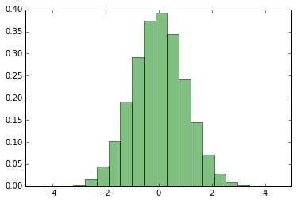
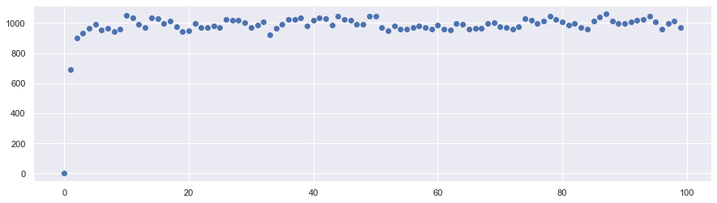

## Harmonic Oscillator using HMC

### Import the Library


```python
'''import section'''
import numpy as np
import matplotlib.pyplot as plt
import math as  math
import random as random
import seaborn as sns
sns.set()
```

We want to apply HMC to collection of 100 independent Harmonic Oscillator to get equilibrium configuration.

### Hamiltonian

Hamiltonian of Harmonic Oscillator in 1D is:

\\( H = \frac{1}{2} p^{2} + \frac{1}{2}q^{2}\\)  with \\( m = 1,k = 1\\)

This function calculates the  total Hamiltonian of the configuration


```python
def hamiltonian(x,p,np):
    '''x,p: x and p are list of position and momentum'''
    '''np : number of particles in the system '''
    H = 0.0
    for k in range(np):
            H = H + ((x[k]*x[k])/2.0 + (p[k]*p[k])/2.0 )
    return H      
```

### Generating Random Momentum

In order to generate random momentum we use "random.gauss"


```python
def drawp(np):
    '''this function returns a list of random numbers'''
    t = [0.0 for k in range(np)]
    for k in range(np):
        r = random.gauss(0.0,1.0)
        t[k] = r
    return(t)       
```

One can check whether the generated numbers are normally distributed or not by doing:


```python
N = 100000 
p = [0.0 for k in range(N)]
p = drawp(N)
num_bins = 100
plt.figure(figsize = [10,6])
plt.hist(p,num_bins, density= 1.0, facecolor='green', alpha = 0.5)
plt.show()
```





### Leap Frog 

We will use leap frog approximation to evolve the system according to time.


```python
def leap_frog(N,dt,ix,ip,np):
    
        ''' N : number of steps to evolve
            dt:  fraction of time ie T  = dt*N
            ix,ip : initial position and momentum
            np : number of the particles in the system
        '''
        ''' Returns
          x,p : final position and momentum'''   
    
    
        x = ix
        p = ip
        k = 0
        while k < N:
            if k == 0:
                    for i in range(np):
                        p[i] = p[i] - ((dt/2.0)*x[i])
            elif k > 0 :
                    if k < N - 1:
                        for i in range(np):   
                            x[i] = x[i] + (dt*p[i])
                            p[i] =   p[i] - (dt*x[i])
                            #S1 = hamiltonian(x,p,np)
                            #print "k =",k,"S1=",S1
                            
            elif k == N - 1:
                          for i in range(np): 
                            p[i] = (p[i] - (dt/2.0)*x[i])
                       
            k = k+1
        return x,p
```

### HMC

Here we run the HMC - simulation


```python
def HMC(np,N,dt,steps,x0):
    
    ''' np : number of particles in the system
        N = number of steps in Leap - Frog
        dt = fraction of time in Leap - Frog
        steps: total steps in HMC '''
    
    
       
    xt = [0.0 for k in range(np)]
    pt = [0.0 for k in range(np)]

    
    p0 = drawp(np)
    H = [0.0 for k in range(steps)]
       
    S0 = hamiltonian(x0,p0,np)
    #print ("=======>", 0,"S0=", S0)


    chain = 1
    total_frac =  0.0
    while chain < steps:
        s_stor = [0.0]
        xt,pt = leap_frog(N,dt,x0,p0,np)
        S1 = hamiltonian(xt,pt,np)
        frac = math.exp(-(S1-S0))
        #print frac
        a = min(1,frac)
        b = random.uniform(0.0,1.0)

        if b < a:
            #print("=======>", chain, "S1=",S1,frac,a,b)
            H[chain] = S1
            x0 = xt
            p0 = drawp(np)
            S0 = hamiltonian(x0,p0,np)
        else:
            H[chain] = S0
            p0 = drawp(np)
            
        chain = chain+1
            
    return H   
```

### Seting Constants


```python
np = 1000
N = 1000
dt = 0.001
steps = 100
```

Call HMC


```python
x0 = [1.0 for k in range(np)]
x0 = [random.uniform(0.0,1.0) for k in range(np)]
H = HMC(np,N,dt,steps,x0)  
```

### Plot


```python
t = [1.0*k for k in range (steps)] 
plt.figure(figsize = [15,4])
plt.scatter(t,H)
plt.show()
```





```python

```
