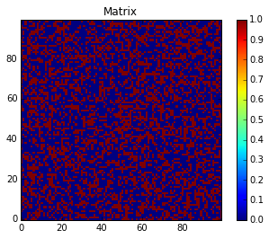
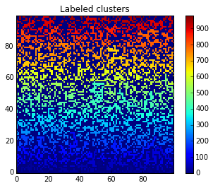
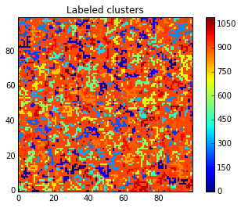
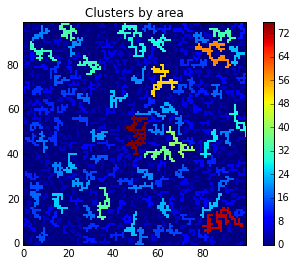
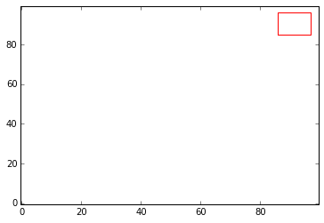
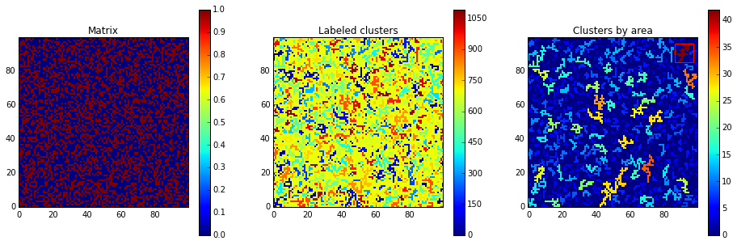

# Percolation

### Percolation


```
from pylab import *
from scipy.ndimage import measurements
```


```
L = 100
r = rand(L,L)
p = 0.4
z = r < p
 
imshow(z, origin='lower', interpolation='nearest')
colorbar()
title("Matrix")
show()
```





```
lw, num = measurements.label(z)
imshow(lw, origin='lower', interpolation='nearest')
colorbar()
title("Labeled clusters")
show()
```





```
b = arange(lw.max() + 1)
shuffle(b)
shuffledLw = b[lw]
imshow(shuffledLw, origin='lower', interpolation='nearest')
colorbar()
title("Labeled clusters")
show()
```





```
area = measurements.sum(z, lw, index=arange(lw.max() + 1))
areaImg = area[lw]
im3 = imshow(areaImg, origin='lower', interpolation='nearest')
colorbar()
title("Clusters by area")
show()
```





```
sliced = measurements.find_objects(areaImg == areaImg.max())
if(len(sliced) > 0):
    sliceX = sliced[0][1]
    sliceY = sliced[0][0]
    plotxlim=im3.axes.get_xlim()
    plotylim=im3.axes.get_ylim()
    plot([sliceX.start, sliceX.start, sliceX.stop, sliceX.stop, sliceX.start], \
                      [sliceY.start, sliceY.stop, sliceY.stop, sliceY.start, sliceY.start], \
                      color="red")
    xlim(plotxlim)
    ylim(plotylim)
 
show()
```





### Final


```
from pylab import *
from scipy.ndimage import measurements
 
L = 100
r = rand(L,L)
p = 0.4
z = r<p
 
figure(figsize=(16,5))
subplot(1,3,1)
imshow(z, origin='lower', interpolation='nearest')
colorbar()
title("Matrix")
 
# Show image of labeled clusters (shuffled)
lw, num = measurements.label(z)
subplot(1,3,2)
b = arange(lw.max() + 1) # create an array of values from 0 to lw.max() + 1
shuffle(b) # shuffle this array
shuffledLw = b[lw] # replace all values with values from b
imshow(shuffledLw, origin='lower', interpolation='nearest') # show image clusters as labeled by a shuffled lw
colorbar()
title("Labeled clusters")
 
# Calculate areas
subplot(1,3,3)
area = measurements.sum(z, lw, index=arange(lw.max() + 1))
areaImg = area[lw]
im3 = imshow(areaImg, origin='lower', interpolation='nearest')
colorbar()
title("Clusters by area")
 
# Bounding box
sliced = measurements.find_objects(areaImg == areaImg.max())
if(len(sliced) > 0):
    sliceX = sliced[0][1]
    sliceY = sliced[0][0]
    plotxlim=im3.axes.get_xlim()
    plotylim=im3.axes.get_ylim()
    plot([sliceX.start, sliceX.start, sliceX.stop, sliceX.stop, sliceX.start], \
                      [sliceY.start, sliceY.stop, sliceY.stop, sliceY.start, sliceY.start], \
                      color="red")
    xlim(plotxlim)
    ylim(plotylim)
 
show()
```




