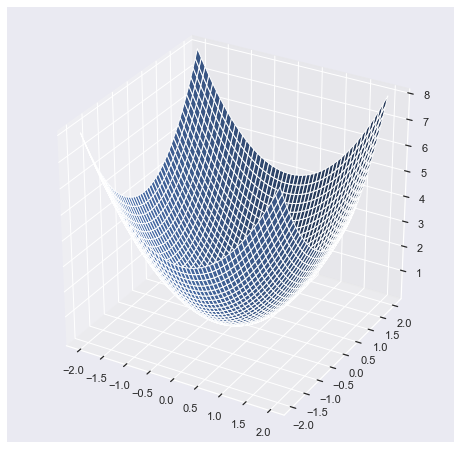
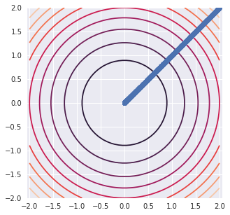
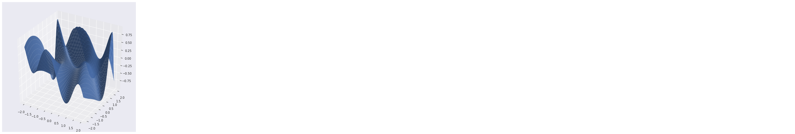
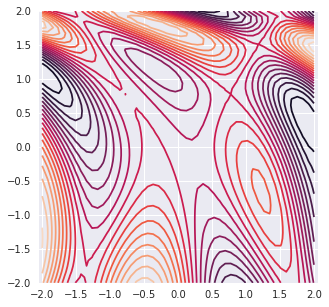
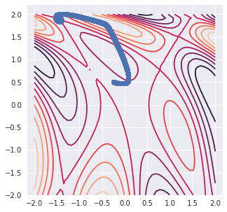

## Scipy Optimization [Source](https://docs.scipy.org/doc/scipy/reference/optimize.html#module-scipy.optimize)

SciPy optimize provides functions for minimizing (or maximizing) objective functions, possibly subject to constraints. It includes solvers for nonlinear problems (with support for both local and global optimization algorithms), linear programing, constrained and nonlinear least-squares, root finding and curve fitting.

1. Scalar Functions Optimization
2. Local (Multivariate) Optimization
3. Global Optimization
4. Least-squares and Curve Fitting
5. Root finding

### Gradient Descient


```python
import numpy as np
import numpy.linalg as la
import scipy.optimize as sopt

import matplotlib.pyplot as pt
from mpl_toolkits.mplot3d import axes3d
%matplotlib inline
import seaborn as sns
sns.set()
```

Spherical Surface : 
$$F(x,y) = x^{2} + y^{2}$$


```python
def sphere(x):
    return x[0]**2 + x[1]**2

def df_sphere(x):
    return np.array([2.0*x[0], 2.0*x[1]])
```

### Plot Surfaces

* Sphere


```python
fig = pt.figure(figsize = [8,8])
ax = fig.gca(projection="3d")

xmesh, ymesh = np.mgrid[-2:2:50j,-2:2:50j]
fmesh = sphere(np.array([xmesh, ymesh]))
ax.plot_surface(xmesh, ymesh, fmesh)
```


    <mpl_toolkits.mplot3d.art3d.Poly3DCollection at 0x1a18961550>





### Plot Concors


```python
pt.figure( figsize = [5,5])
pt.axis("equal")
pt.contour(xmesh, ymesh, fmesh,20)
```


    <matplotlib.contour.QuadContourSet at 0x7f0bfe84f7b8>


### Find Minimum


```python
guesses = [np.array([2,2])]
for i in range(10000):
    x = guesses[-1]
    s = -df_sphere(x)
    alpha = 0.001

    next_guess = x + alpha * s
    guesses.append(next_guess)
```


```python
guesses[0:10]
```


    [array([2, 2]),
     array([1.996, 1.996]),
     array([1.992008, 1.992008]),
     array([1.98802398, 1.98802398]),
     array([1.98404794, 1.98404794]),
     array([1.98007984, 1.98007984]),
     array([1.97611968, 1.97611968]),
     array([1.97216744, 1.97216744]),
     array([1.96822311, 1.96822311]),
     array([1.96428666, 1.96428666])]


```python
pt.figure( figsize = [5,5])
pt.axis("equal")
pt.contour(xmesh, ymesh, fmesh, 10)
it_array = np.array(guesses)
pt.plot(it_array.T[0], it_array.T[1], "o")
```


    [<matplotlib.lines.Line2D at 0x7f0bfea38828>]





### Abritrary Surface [source](https://en.wikipedia.org/wiki/Gradient_descent)


```python
def surface(x):
    return np.sin(0.5*x[0]**2 -0.25*x[1]**2 + 3)*np.cos(2.0*x[0] + 1.0 + np.exp(x[1]))

def df_surface(x):
    
    u = np.sin(0.5*x[0]**2 -0.25*x[1]**2 + 3)
    u_x = np.cos(0.5*x[0]**2 -0.25*x[1]**2 + 3)*x[0]
    u_y = -np.cos(0.5*x[0]**2 -0.25*x[1]**2 + 3)*0.5*x[1]
                                                     
    v = np.cos(2.0*x[0] + 1.0 + np.exp(x[1]))
    v_x = -np.sin(2.0*x[0] + 1.0 + np.exp(x[1]))*2.0
    v_y = np.sin(2.0*x[0] + 1.0 + np.exp(x[1]))*np.exp(x[1])                                              
    
    df_x = u_x*v + u*v_x
    df_y = u_y*v + u*v_y
                                                     
    return np.array([df_x,df_y])
```

### Plot Surface


```python
fig = pt.figure(figsize = [8,8])
ax = fig.gca(projection="3d")

xmesh, ymesh = np.mgrid[-2:2:50j,-2:2:50j]
fmesh = surface(np.array([xmesh, ymesh]))
ax.plot_surface(xmesh, ymesh, fmesh)
```


    <mpl_toolkits.mplot3d.art3d.Poly3DCollection at 0x7f0bfea68cc0>





### Plot Contor


```python
pt.figure( figsize = [5,5])
pt.axis("equal")
pt.contour(xmesh, ymesh, fmesh,20)
```


    <matplotlib.contour.QuadContourSet at 0x7f0bfeb2d390>





```python
guesses = [np.array([-0.25,0.5])]
for i in range(100000):
    x = guesses[-1]
    s = -df_surface(x)
    alpha = 0.0001

    next_guess = x + alpha * s
    guesses.append(next_guess)
```


```python
guesses[0:10]
```


    [array([-0.25,  0.5 ]),
     array([-0.24995774,  0.4999897 ]),
     array([-0.24991547,  0.49997941]),
     array([-0.24987321,  0.49996911]),
     array([-0.24983095,  0.49995882]),
     array([-0.24978869,  0.49994853]),
     array([-0.24974643,  0.49993824]),
     array([-0.24970417,  0.49992795]),
     array([-0.24966191,  0.49991766]),
     array([-0.24961965,  0.49990738])]


```python
pt.figure( figsize = [5,5])
pt.axis("equal")
pt.contour(xmesh, ymesh, fmesh, 10)
it_array = np.array(guesses)
pt.plot(it_array.T[0], it_array.T[1], "o")
```


    [<matplotlib.lines.Line2D at 0x7f0bfdcb7e80>]





### Scipy Optimization


```python
from scipy.optimize import minimize
```

* Sphere


```python
x0 = [np.array([5,5])]
res = minimize(sphere, x0, method='nelder-mead',
                options={'xtol': 1e-8, 'disp': True})
```

    Optimization terminated successfully.
             Current function value: 0.000000
             Iterations: 73
             Function evaluations: 137


```python
res
```


     final_simplex: (array([[-1.53149299e-09,  3.72359970e-09],
           [-1.89733109e-09, -4.32207878e-09],
           [ 5.12426026e-09, -1.63696990e-09]]), array([1.62106655e-17, 2.22802302e-17, 2.89377136e-17]))
               fun: 1.6210665476880626e-17
           message: 'Optimization terminated successfully.'
              nfev: 137
               nit: 73
            status: 0
           success: True
                 x: array([-1.53149299e-09,  3.72359970e-09])


* Surface


```python
x0 = [np.array([-0.25,0.5])]
res = minimize(surface, x0, method='nelder-mead',
                options={'xtol': 1e-8, 'disp': True})
```

    Optimization terminated successfully.
             Current function value: -0.380860
             Iterations: 76
             Function evaluations: 148


```python
res
```


     final_simplex: (array([[-0.36266707,  1.17858233],
           [-0.36266707,  1.17858233],
           [-0.36266707,  1.17858233]]), array([-0.38086004, -0.38086004, -0.38086004]))
               fun: -0.3808600432413275
           message: 'Optimization terminated successfully.'
              nfev: 148
               nit: 76
            status: 0
           success: True
                 x: array([-0.36266707,  1.17858233])


## Newton's Conjugate Gradient Method

The minimum value of this function is 0 which is achieved when x =1


```python
def rosen(x):
    """The Rosenbrock function"""
    return sum(100.0*(x[1:]-x[:-1]**2.0)**2.0 + (1-x[:-1])**2.0)
```


```python
def rosen_der(x):
    xm = x[1:-1]
    xm_m1 = x[:-2]
    xm_p1 = x[2:]
    der = np.zeros_like(x)
    der[1:-1] = 200*(xm-xm_m1**2) - 400*(xm_p1 - xm**2)*xm - 2*(1-xm)
    der[0] = -400*x[0]*(x[1]-x[0]**2) - 2*(1-x[0])
    der[-1] = 200*(x[-1]-x[-2]**2)
    return der
```


```python
def rosen_hess(x):
    x = np.asarray(x)
    H = np.diag(-400*x[:-1],1) - np.diag(400*x[:-1],-1)
    diagonal = np.zeros_like(x)
    diagonal[0] = 1200*x[0]**2-400*x[1]+2
    diagonal[-1] = 200
    diagonal[1:-1] = 202 + 1200*x[1:-1]**2 - 400*x[2:]
    H = H + np.diag(diagonal)
    return H
```


```python
x0 = np.array([1.3, 0.7, 0.8, 1.9, 1.2])
```


```python
res = minimize(rosen, x0, method='Newton-CG',jac=rosen_der, hess=rosen_hess,
                options={'xtol': 1e-8, 'disp': True})
```

    Optimization terminated successfully.
             Current function value: 0.000000
             Iterations: 24
             Function evaluations: 33
             Gradient evaluations: 56
             Hessian evaluations: 24


```python
res.x
```


    array([1.        , 1.        , 1.        , 0.99999999, 0.99999999])


------

### References

1. https://andreask.cs.illinois.edu/cs357-s15/public/demos/12-optimization/Steepest%20Descent.html
2. https://scipy-lectures.org/advanced/mathematical_optimization/auto_examples/plot_gradient_descent.html
3. https://docs.scipy.org/doc/scipy/reference/tutorial/optimize.html
4. https://scipy-cookbook.readthedocs.io/index.html
5. http://folk.ntnu.no/leifh/teaching/tkt4140/._main000.html
